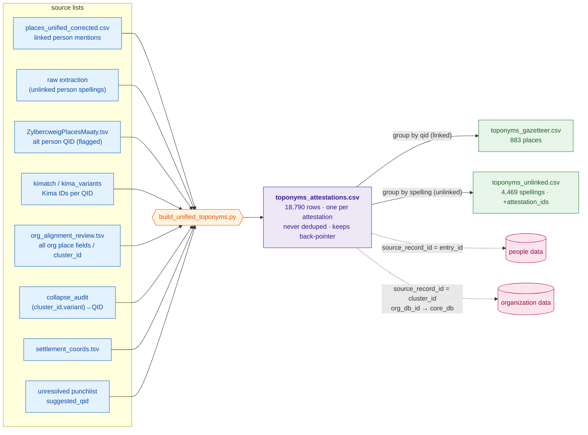
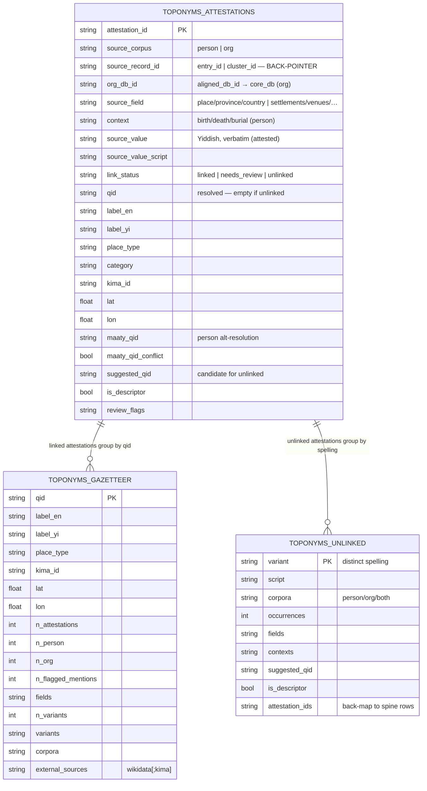

# Unified toponym dataset — visual schema

> Rendered with Mermaid (VSCode markdown preview / GitHub). Prose in
> [unified_toponyms.md](unified_toponyms.md).

## 1. Architecture — attestation spine + derived views + enrich-back

## 2. Entity relationship — spine and its derived views

